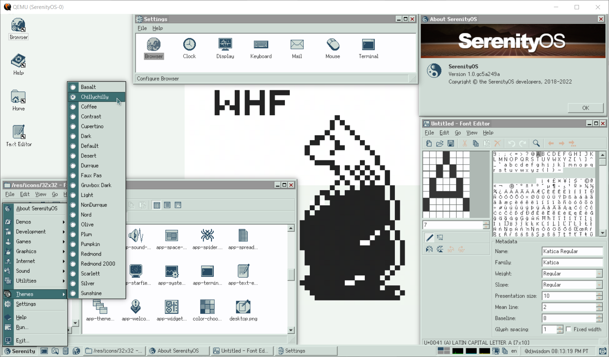

# SerenityOS Themes (Unofficial)
This repo is a collection of different themes I created for SerenityOS through bursts of inspiration while having zero theme creation knowledge. It is fine by me if these themes don't see the light of day being merged to master, I did try submitting a [PR](https://github.com/SerenityOS/serenity/pull/13188) and was naturally turned down. And so, I [tried](https://github.com/SerenityOS/serenity/pull/13255) again. And [again](https://github.com/SerenityOS/serenity/pull/13410).  :^)

Draft themes are very rudimentary and does not yet conform to SerenityOS technical standards while Stable themes are personally considered to be somewhat compliant, all that remains after PR submission is the elusive approval and merge status. 

After submitting several themes which were mostly turned down, I was glad to be able to put in at least two themes!

Moving forward, this looks like the direction where SerenityOS Themes are concerned. The closing comment says it all.

I may or may no longer add to the themes here on my personal repo since I am 100% in total support with what the official thrust now is as aptly worded on the comment above. :^)

## Themes created by djwisdom 
BSD 2-Clause License

## CakePlacid Theme (light)
Status: Unofficial/Draft

## Coolio Theme (light)
Status: Unofficial/Draft

## CudbearGriz Theme (dark)
Status: Unofficial/Draft

## CudbearPal Theme (dark)
Status: Unofficial/Draft

## Miniminty Theme (light)
Status: Closed/Stable [PR](https://github.com/SerenityOS/serenity/pull/13410)

## Chillychilly All-in-One Theme (light)
Status: Official

## Durrque Theme (dark)
Status: Official [PR](https://github.com/SerenityOS/serenity/pull/13620)

## Nondurrque Theme (light)
Status: Closed/Stable [PR](https://github.com/SerenityOS/serenity/pull/13636)

Individual theme status will be updated if and when they are merged to SerenityOS master repo.
